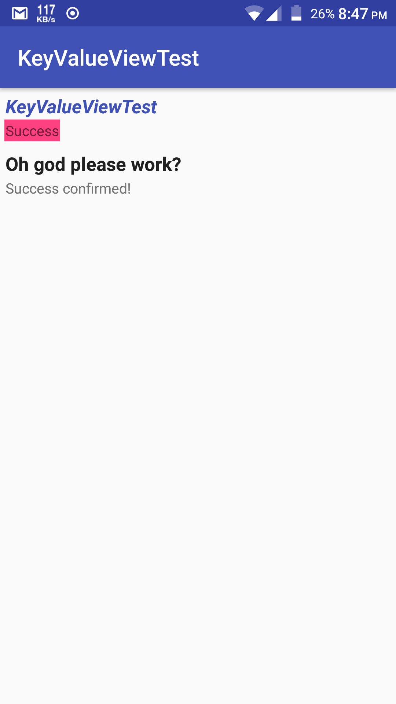

# KeyValueView
A view containing 2 TextViews in a vertical LinearLayout, one will show a heading or a key, the other one will show its value. By default, the key is slightly larger and has properties so that it signifies more emphasis.

### Usage
Assuming you already have configured jitpack and added the dependency for this library in your project gradle files, simply add this in your layout to include it.
```
<com.corphish.widgets.KeyValueView
       android:layout_width="wrap_content"
       android:layout_height="wrap_content"/>
```

### Properties supported
- `app:keyText` : Sets the _Key_ text. Can be a text or a string resource (recommended).
- `app:valueText` : Sets the _Value_ text. Can be a text or a string resource (recommended).
- `app:keySize` : Sets the text size of _Key_. Default is __17sp__.
- `app:valueSize` : Sets the text size of _Value_. Default is __13sp__.
- `app:keyEnabled` : Sets the _Key_ enabled if its true, false otherwise. Default value is __true__ for obvious reasons.
- `app:valueEnabled` : Sets the _Value_ enabled if its true, false otherwise. Default is __true__ for obvious reasons. ___Note:___ If both Key and Value are disabled, the entire view is disabled, that means any event listeners set for the entire view will not work for example.
- `app:keyStyle` : Sets the style specified to _Key_. Default is __Normal__.
- `app:valueStyle` : Sets the style specified to _Value_. Default is __Normal__.
- `app:absoluteSpacing` : Sets the line spacing between the Key and Value with the value specified. There are 2 spacings here, one below the Key and other above the Value. Default is __1dp__ + __1dp__.
- `app:absoluteSpacingTop` : Sets the line spacing above _Value_, spacing below the key is unaffected. Default is __1dp__.
- `app:absoluteSpacingBottom` : Sets line spacing below _Key_. Line spacing above _Value_ is unaffected. Default is __1dp__.
- `app:relativeSpacing`, `app:relativeSpacingTop`, `app:relativeSpacingBottom` : Use these properties to increase/decrease the spacing if you do not choose to use absolute spacing.
- `app:keyTextColor` : Sets text color of _Key_. Default is the default text color of your theme.
- `app:valueTextColor` : Sets text color of _Value_. Default is the default text color of your theme.
- `app:keyBackgroundColor` : Sets background color of _Key_. Default is __transparent__.
- `app:valueBackgroundColor` : Sets background color of _Value_. Default is __transparent__.
- `app:methodForValue` : The method that is executed and the return value of it is set as the _Value_ text. You need to provide full path of the method, that is including the package name, class (and subclasses if present), and then the method name (see [this](https://github.com/corphish/Widgets/blob/master/app/src/main/res/layout/activity_main.xml#L29)). If however the method is present in the Activity source which contains the layout containing the KeyValueView, then you can only specify the method name (see [this](https://github.com/corphish/Widgets/blob/master/app/src/main/res/layout/activity_main.xml#L19)). The method must return String and must be fairly simple. If you are doing some long running or complex task, then you might consider setting values programmatically.

### Methods
Most of the methods are used up by properties. See the [source](https://github.com/corphish/Widgets/blob/master/widgets/src/main/java/com/corphish/widgets/KeyValueView.java) file for reference.
Additionally there are `getKeyTextView()` and `getValueTextView()` methods which return the respective TextViews, on which you can do other TextView actions that it supports.

### Screenshot
 