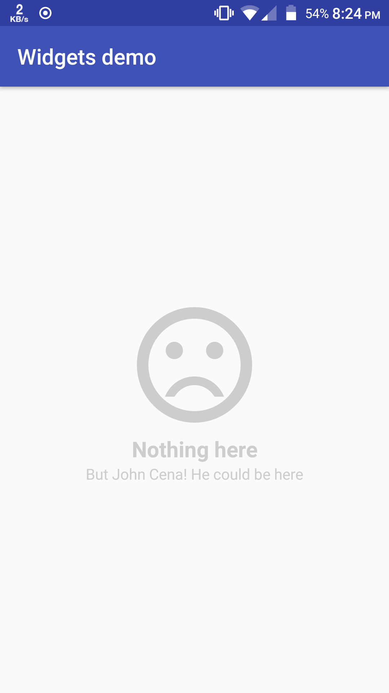

# PlaceholderView
A view which you would inside a layout as a placeholder for showing some content which could take time to process and show. For example: Lets say you perform search on your data and then show the results inside a layout, if search returned zero results, this view can be used to describe it, instead of showing empty view. Other use cases would be to show failure messages for a long running operation, and many more.

### Usage
Assuming you already have configured jitpack and added the dependency for this library in your project gradle files, simply add this in your layout to include it.
```xml
<com.corphish.widgets.PlaceholderView
       android:layout_width="wrap_content"
       android:layout_height="wrap_content"/>
```  
###### Tip
To center this view in the layout, or to make it appear in the center of the screen, use `RelativeLayout` as parent, and then set the `android:layout_centerInParent` property of the PlaceholderView to __true__, as shown:  
```xml
<RelativeLayout
    xmlns:android="http://schemas.android.com/apk/res/android"
    android:layout_width="match_parent"
    android:layout_height="match_parent">  
    
    <com.corphish.widgets.PlaceholderView
        android:layout_width="wrap_content"
        android:layout_height="wrap_content"
        android:layout_centerInParent="true"/>

</RelativeLayout>
```  

### Properties Supported
- `app:titleText` : Sets the title text.
- `app:descriptionText` : Sets the description text.
- `app:srcCompat` : Drawable resource id for the image (see the screenshot below).
- `app:imageHeight` : Sets the image height. Default is __wrap_content__.
- `app:imageWidth` : Sets the image width. Default is __wrap_content__.
- `app:titleSize` : Sets the text size of title. Default is __18sp__.
- `app:descriptionSize` : Sets the text size of description. Default is __12sp__.
- `app:viewTint` : Sets the tint of the view.
- `app:titleStyle` : Sets the text style of title.
- `app:descriptionStyle` : Sets the text style of description.

### Methods
Most of the methods are used up by properties. See the [source](https://github.com/corphish/Widgets/blob/master/widgets/src/main/java/com/corphish/widgets/PlaceholderView.java) file for reference.
Additionally there are `getTitleTextView()`, `getDescriptionTextView()` and `getImageView()` methods which return the respective TextViews and AppCompatImageViews, on which you can do other actions that it supports.

### Screenshot
###### Code
```xml
<?xml version="1.0" encoding="utf-8"?>
<RelativeLayout
    xmlns:android="http://schemas.android.com/apk/res/android"
    xmlns:app="http://schemas.android.com/apk/res-auto"
    xmlns:tools="http://schemas.android.com/tools"
    android:layout_width="match_parent"
    android:layout_height="match_parent"
    tools:context="com.corphish.keyvalueviewtest.MainActivity">  
    

    <com.corphish.widgets.PlaceholderView
        android:layout_margin="4dp"
        app:titleText="Nothing here"
        app:descriptionText="But John Cena! He could be here"
        app:titleStyle="bold"
        app:titleSize="20sp"
        app:srcCompat="@drawable/ic_sentiment_dissatisfied_black_128dp"
        app:descriptionSize="14sp"
        app:viewTint="#cdcdcd"
        android:layout_width="wrap_content"
        android:layout_height="wrap_content"
        android:layout_centerInParent="true"/>

</RelativeLayout>
```  
###### Result
 